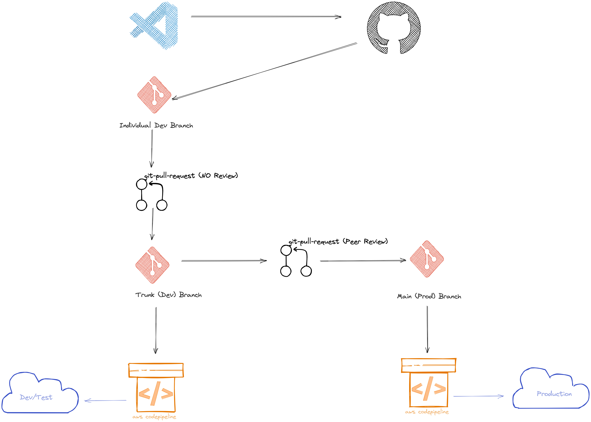

# apis
This repo is dedicated to any API services.

We have to maintain Trunk Based development branching strategy

> Trunk-based development (TBD) is a branching strategy where all developers integrate their changes directly to a shared trunk every day, a shared trunk that is always in a releasable state. No matter what a developer might do on their local repository, at least once each day, they must integrate their code. This practice forces each developer to regularly see and react to the changes being made by their teammates in version control, which drives collaboration around the quality and state of the codebase as a near-constant activity. (TASK)
> TBD allows for the use of other branches, such as a short-lived release branch off the trunk for executing a release and local-only feature branches, but neither are required to practice TBD. As Continuous Delivery and DevOps have become increasingly prominent and even necessary for many software development teams, TBD has the tightest alignment with those modern delivery approaches. In fact, trunk-based development is a prerequisite for CI/CD. (TASK)

The following is an illustration of trunk based development branching system (temporary since it doesn't reflect our strategy correctly)

